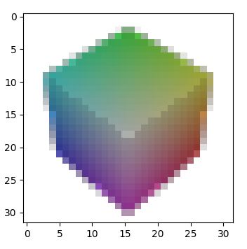

# GAN for 3D objects
This repository defines a GAN that can learn 3D geometry from images. The discriminator is based on StyleGAN-2, and the generator is a coordinate neural network, representing a signed-distance field (SDF), based on the FiLM-SIREN architecture from pi-GAN (Chan _et al._ 2020). The generator is conditioned on a latent code, sampled from a normal distribution.

The system supports automatic mixed-precision, logging to Tensorboard (`/dfr/logger.py`), checkpointing (`/dfr/ckpt.py`). 

To get a preview of the raycaster in action, clone the repository, run `pip install -r requirements.txt`, and make sure you've got CUDA set up. Then run `python -m tools.raycast`, and you'll get something like this:



## Differentiable raycaster
Differentiable rendering is necessary to optimize the SDF, so I've built an extremely fast differentiable raycaster (`/dfr/raycast`). I think this is the coolest part of the code, so here is a detailed description.

The camera angle is randomized per batch, in order to optimize all parts of the shapes. So the first step in raycasting is to construct a unitary 3D rotation matrix from a position on the unit sphere (given by 2 angles: theta, phi).
```python
# create rotation matrices from camera angles (phi, theta)
# angles is a tuple of two 1D tensors
def rotateAxes(angles):
  phis, thetas = angles
  cos_theta = torch.cos(thetas)
  sin_theta = torch.sin(thetas)
  cos_phi = torch.cos(phis)
  sin_phi = torch.sin(phis)

  # composition of 2 transforms: rotate theta first, then phi
  return torch.stack([
    torch.stack([cos_theta, -sin_theta * sin_phi, cos_phi * sin_theta], dim=1),
    torch.stack([torch.zeros_like(cos_phi), cos_phi, sin_phi], dim=1),
    torch.stack([-sin_theta, -sin_phi * cos_theta, cos_phi * cos_theta], dim=1),
  ], dim=2)
```
The resulting matrix will rotate the coordinate frame such that the positive Z-axis points to the desired location. The advantage of this method is that once the axes are rotated, we no longer need to worry about rotating anything.

Next, we construct a grid of rays aiming from the positive Z-axis (which is now rotated correctly)
```python
# construct a grid of rays viewing the origin from the camera
# axes is a batch x 3 x 3 tensor representing the bases of the rotated coordinate frames
# px is the resolution of the ray grid
# D is the scalar camera distance from the origin
def rayGrid(axes, px, D):
  edge = 1. - 1 / px
  xSpace = torch.linspace(-edge, edge, steps=px, device=axes.device).repeat(px, 1)[None, :, :, None]
  ySpace = -xSpace.transpose(1, 2)
  x = axes[:, 0][:, None, None, :]
  y = axes[:, 1][:, None, None, :]
  z = axes[:, 2][:, None, None, :]

  # each ray is the difference between a point in the square and the camera position (z * D)
  rays = xSpace * x + ySpace * y - z * D
  return rays / rays.norm(dim=3, keepdim=True)
```
This produces a tensor of unit vectors which represent a grid of rays (one per pixel). The field-of-view is assumed to match the square in the XY-plane [-1, 1] X [-1, 1]. It is very important to construct the rays to be equally spaced in this square for the image to be undistorted. This is _not_ the same as equal angles between rays; that would cause spherical distortion.

Finally, since the object is inside the unit sphere, we should figure out where each ray enters and exits the unit sphere and only scan in that region. This is actually a neat geometry problem (involves using the law of cosines to determine the length of a side of an irregular tetrahedron), and the solution is given by the roots of a quadratic. If the ray misses the unit sphere altogether, the roots are complex; otherwise, there are 1 (tangent) or 2 (intersection) real roots. This method computes the distance along each ray of the intersection, and a boolean mask that represents rays that have a proper intersection with the sphere.
```python
# find the near and far intersections of each ray with the unit sphere
# the solution is a quadratic in the distance along the ray with complex roots iff the ray misses
def computePlanes(rays, axes, cameraD):
  z = axes[:, 2][:, None, None, None, :]
  center = cameraD * (-z @ rays.unsqueeze(4)).flatten(2)
  # clamp to min=0 to ignore complex roots
  delta = (center ** 2 - cameraD ** 2 + 1).clamp(min=0.).sqrt()
  return center - delta, center + delta, delta > 1e-5
```

Since we're using an implicit neural network to represent geometry, each ray step requires a network forward pass, and rendering an object in 64x64 usually takes around 30k steps. This is really expensive, so we apply all sorts of optimizations to the raycasting process.

This method marches along rays in order to find the surface of the object (which is a root of the neural network; `f(x) = 0`). It uses sphere-tracing to optimize the convergence rate, and implements some clever boolean masking to avoid evaluation for rays that have either intersected the object or exited the unit sphere (which the object is assumed to be bounded by). 
```python
# batched sphere tracing with culling of terminated rays
def sphereTrace(rays, origin, planes, latents, sdf, threshold, steps=16):
  minValues = 5.0 * torch.ones(rays.shape[0], device=rays.device)
  mask = torch.ones_like(minValues, dtype=torch.bool)
  distance = planes[0] + 2.0 / steps
  minDistances = distance.clone()

  # start from 1, because the initial critical points are the 0-idx
  for i in range(1, steps):
    # march along each ray
    # compute the next target point
    targets = (origin + rays * distance.unsqueeze(1))[mask]

    # stop if all rays have terminated
    if targets.shape[0] == 0:
      break

    # evaluate the targets
    with autocast(enabled=Flags.AMP):
      values = sdf(targets, latents, mask, geomOnly=True).squeeze(1).type(torch.float)
    del targets

    # TODO: this is a bottleneck
    # Boolean indexing produces a variably-sized result, which causes an
    # expensive CPU-GPU sync. But all of these masks work together to limit the
    # number of SDF queries, which is also very expensive.
    minMask = values < minValues[mask]
    updateMask = torch.zeros_like(mask)
    updateMask[mask] = minMask

    floatMask = updateMask.float()
    # update min and argmin
    minDistances = (1 - floatMask) * minDistances + floatMask * distance
    minValues[updateMask] = values[minMask]

    # terminate all rays that intersect the surface (negated)
    intersectMask = values > threshold

    # sphere trace
    distance[mask] += values

    # terminate rays that exit the unit sphere on the next step (again negated)
    exitMask = distance < planes[1] * mask.float()

    mask[mask] = intersectMask
    mask = torch.logical_and(mask, exitMask)

  return minValues, minDistances
```

In fact, this is _still_ too slow to use on my RTX 3080, so the outer loop implements a further optimization: first find out roughly where the object is at low resolution, and progressively increase the resolution in order to avoid wasting time on regions that miss the object.
```python
# nearest-neighbor upsampling
def upsample(t, scale):
  return t.repeat_interleave(scale, dim=1).repeat_interleave(scale, dim=2)

# iteratively raycast at increasing resolution
def multiscale(axes, scales, latents, sdf, threshold, fov=25 * (np.pi / 180)):
  cameraD = 1.0 / np.tan(fov / 2.0)

  terminal = torch.zeros(axes.shape[0], 1, 1, 1, device=axes.device)
  rayMask = torch.ones_like(terminal, dtype=torch.bool).squeeze(3)
  origin = cameraD * axes[:, 2][:, None, None, :]
  latents = latents[:, None, None, :]
  size = 1

  for idx, scale in enumerate(scales):
    if idx > 0:
      # a geometric bound for whether a super-ray could have subrays that intersected the object
      k = distances * 2 * np.tan(fov / (2. * size))
      # this is suspicious because it uses a step size which is not actually used by sphere tracing
      # also the 0.5 at the end is empirical
      bound = torch.sqrt(2. * k ** 2. + (1.0 / 16.0) ** 2) * 0.5

      # subdivide the rays that pass close to the object
      rayMask[rayMask] = minValues <= bound

    size *= scale
    rays = rayGrid(axes, size, cameraD)
    near, far, sphereMask = computePlanes(rays, axes, cameraD)
    if idx == 0:
      smallestMask = sphereMask

    terminal = upsample(terminal, scale)
    rayMask = upsample(rayMask, scale)
    expandedLatents = latents.expand(-1, size, size, -1)
    expandedOrigin = origin.expand(-1, size, size, -1)

    # terminate rays that don't intersect the unit sphere
    rayMask = torch.logical_and(rayMask, sphereMask)
    planes = torch.stack([near[rayMask], far[rayMask]])

    minValues, distances = sphereTrace(rays[rayMask],
                                expandedOrigin[rayMask],
                                planes,
                                expandedLatents[rayMask],
                                sdf,
                                threshold=threshold)

    terminal[rayMask] = distances.unsqueeze(1)

  # use the lowest-resolution mask, because the high res mask includes unsampled rays
  sphereMask = upsample(smallestMask, size // scales[0])
  points = (origin + terminal * rays)[sphereMask]
  points.requires_grad = True
  return SampleData(points, expandedLatents, sphereMask)
```

Once we have the desired points, we'll need to find the normals to the surface for the shading step. Since the surface is defined by a neural network, we can just compute the gradients as we usually do:
```
# a shortcut to compute a gradient, possibly with AMP
def grad(inputs, outputs, gradScaler=None):
  if gradScaler is not None:
    outputs = gradScaler.scale(outputs)
  out = torch.autograd.grad(outputs=outputs,
                            inputs=inputs,
                            grad_outputs=torch.ones_like(outputs),
                            create_graph=True)[0]
  if gradScaler is not None:
    return out / gradScaler.get_scale()
  return out
  
# get the normal vectors (data.points is the input; values is the output)
# from `/dfr/raycast/__init__.py`
normals = grad(data.points, values, gradScaler)
```

Finally, we'll need to shade the surfaces using the normal data and color data (also computed by the neural net).
```
# compute an illumination map based on the angle between the light and the surface normal
def illuminate(light, normals):
  dot = torch.matmul(normals.view(light.shape[0], -1, 1, 3), light.view(-1, 1, 3, 1)).view(-1, 1)
  return (dot + 1.0) / 2.0

# take values masked to a circle and arrange them in a square image
def unmask(values, mask):
  valueMap = torch.ones(*mask.shape, values.shape[1], device=mask.device)
  # have to cast manually, since AMP doesn't autocast index puts
  valueMap[mask] = values.to(valueMap.dtype)
  return valueMap.permute(0, 3, 1, 2)

# given SDF values, normals, and texture, construct an image
def shade(values, textures, normals, light, sphereMask):
  illum = illuminate(light, normals)

  valueMap = unmask(values, sphereMask)
  colorMap = unmask(textures, sphereMask)
  illumMap = unmask(illum, sphereMask)

  # the illumination value isn't well defined outside the surface, and can mess up the gradients
  illumMap[valueMap > 0] = 0.7

  surfaceMask = (valueMap < 0).float()
  px = sphereMask.shape[2]
  fuzz = (1 - px / 2 * valueMap).clamp(0, 1)
  surface = torch.threshold((1 - valueMap), 1, 0).clamp(0, 1)
  opacity = fuzz * (1 - surfaceMask) + surface * surfaceMask

  return torch.cat([illumMap * colorMap * opacity, opacity], dim=1)
```

And that's the renderer. The rest of the code is fairly straightforward (neural network definitions, dataloading, GAN training loop).
